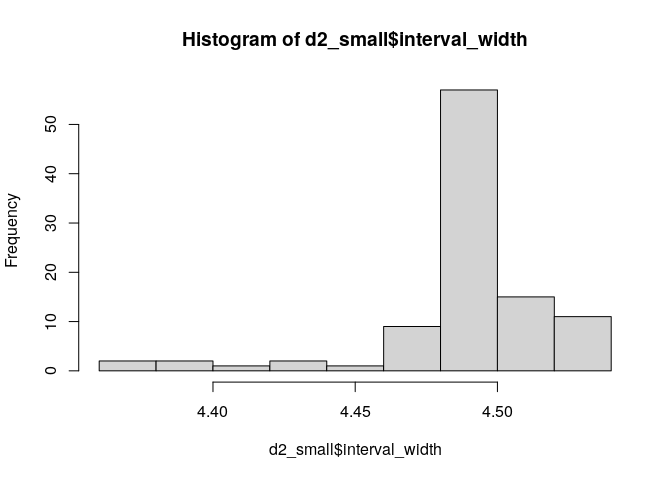
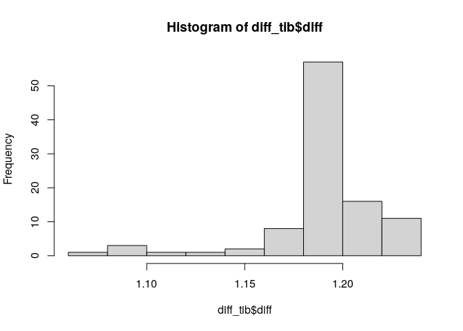

Simple simulations with CV+
================
Fred Boehm
2/15/23

- <a href="#goal" id="toc-goal"><span class="toc-section-number">1</span>
  Goal</a>
- <a href="#approach" id="toc-approach"><span
  class="toc-section-number">2</span> Approach</a>
- <a href="#small-training-set-analysis"
  id="toc-small-training-set-analysis"><span
  class="toc-section-number">3</span> Small training set analysis</a>
- <a href="#compare-interval-widths-between-two-sample-sizes"
  id="toc-compare-interval-widths-between-two-sample-sizes"><span
  class="toc-section-number">4</span> Compare interval widths between two
  sample sizes</a>

## Goal

The goal here is to examine the CV+ interval widths as a function of
sample size in a very simple simulations setting.

## Approach

We’ll simulate a x vector, then simulate y\|x for 101,000 subjects. We
then hold out the 1000 test set subjects, which are randomly chosen from
the 101,000.

The remaining 100,000 constitute the training set. We do CV+ (5-fold)
with them, then construct prediction intervals for the predicted values.

We also do an analysis with exactly 10,000 training set subjects. That
is, we do CV+, 5-fold, with the 10,000 subjects before constructing
intervals for the test set.

``` r
set.seed(2023-02-16)

n <- 101000
x <- rnorm(n = n)
b <- 10
epsilon <- rnorm(n = n)
y <- x * b + epsilon
dat_all <- tibble::tibble(id = 1:n,
               x = x,
               y = y
               )
```

We now sample 1000 test subjects.

``` r
library(magrittr)
test_ids <- sample(x = dat_all$id, size = 1000)
dat_test <- dat_all %>%
              dplyr::filter(id %in% test_ids)
dat_training_pre <- dat_all %>%
                  dplyr::filter(!(id %in% test_ids))
```

We then partition the 100,000 training set samples into five subsets of
20,000 each.

``` r
training_ids_shuffled <- sample(x = dat_training_pre$id, size = 100000)
folds <- cut(seq(1, 100000), breaks=5, labels=FALSE)
dat_training <- tibble::tibble(id = training_ids_shuffled, fold = folds) %>%
                  dplyr::left_join(dat_training_pre, by = "id") %>%
                  dplyr::arrange(id)
```

We then regress y on x with 5-fold CV.

``` r
predvals <- list()
lm_out_list <- list()
for (i in 1:5){
  dd <- dat_training %>%
          dplyr::filter(fold != i)
  lm_out <- lm(y ~ x, data = dd)
  lm_out_list[[i]] <- lm_out
  te <- dat_training %>%
          dplyr::filter(fold == i)
  te_design <- cbind(1, te$x)
  predvals[[i]] <- te %>%
    dplyr::mutate(predicted = as.vector(te_design %*% lm_out$coefficients))  
}
pred <- predvals %>%
          dplyr::bind_rows() %>%
          dplyr::arrange(id) %>%
          dplyr::mutate(absolute_residual = abs(y - predicted))
```

Now, we have the five functions that are needed to get the five
predicted values per test set subject.

``` r
alpha <- 0.1
# construct the five intervals for each test set subject
test_fitted <- list()
for (i in 1:5){
    design_matrix <- cbind(1, dat_test$x)
    test_fitted[[i]] <- dat_test %>% 
                            dplyr::mutate(fitted = as.vector(design_matrix %*% lm_out_list[[i]]$coefficients))
}
```

``` r
qplus <- function(x, alpha = 0.1){
    n <- length(x)
    index <- ceiling((1 - alpha) * (n + 1))
    # order x in ascending order
    x_ordered <- sort(x)
    return(x_ordered[index])
}
tf_tib <- tibble::tibble(test_fitted[[1]]$fitted, test_fitted[[2]]$fitted, test_fitted[[3]]$fitted, test_fitted[[4]]$fitted, test_fitted[[5]]$fitted)


upper <- numeric(length = 1000)
lower <- numeric(length = 1000)
for (test_index in 1:1000){
    indices <- pred$fold
    mu_hat <- tf_tib[test_index, indices] %>% as.numeric()
    rr <- pred$absolute_residual
    sum_vec <- mu_hat + rr 
    diff_vec <- mu_hat - rr
    upper[test_index] <- qplus(sum_vec, alpha)    
    lower[test_index] <- - qplus( - diff_vec, alpha)
}
d2 <- dat_test %>%
        dplyr::mutate(lower = lower, 
                      upper = upper, 
                      in_interval = (y <= upper & y >= lower),
                      interval_width = upper - lower
                      )
```

``` r
# summarise d2 contents
d2 %>%
    dplyr::summarise(coverage = mean(in_interval))
```

    # A tibble: 1 × 1
      coverage
         <dbl>
    1    0.893

``` r
hist(d2$interval_width)
```


## Small training set analysis

The goal here is to use only 1000 subjects - 5 folds of 200 each - in
CV+. I’ll use the same 1000 test set subjects.

``` r
dat_tr_list <- list()
for (i in 1:5){
    dtr <- dat_training %>%
        dplyr::filter(fold == i)
    ids_to_keep <- sample(dtr$id, size = 200)
    dat_tr_list[[i]] <- dtr %>%
                            dplyr::filter(id %in% ids_to_keep)    
}
dat_tr <- dat_tr_list %>% dplyr::bind_rows()
```

``` r
predvals <- list()
lm_out_list <- list()
for (i in 1:5){
  dd <- dat_tr %>%
          dplyr::filter(fold != i)
  lm_out <- lm(y ~ x, data = dd)
  lm_out_list[[i]] <- lm_out
  te <- dat_tr %>%
          dplyr::filter(fold == i)
  te_design <- cbind(1, te$x)
  predvals[[i]] <- te %>%
    dplyr::mutate(predicted = as.vector(te_design %*% lm_out$coefficients))  
}
pred <- predvals %>%
          dplyr::bind_rows() %>%
          dplyr::arrange(id) %>%
          dplyr::mutate(residual = y - predicted) %>%
          dplyr::mutate(absolute_residual = abs(residual))
# construct the five intervals for each test set subject
test_fitted <- list()
for (i in 1:5){
    design_matrix <- cbind(1, dat_test$x)
    test_fitted[[i]] <- dat_test %>% 
                            dplyr::mutate(fitted = as.vector(design_matrix %*% lm_out_list[[i]]$coefficients))
}
tf_tib <- tibble::tibble(test_fitted[[1]]$fitted, test_fitted[[2]]$fitted, test_fitted[[3]]$fitted, test_fitted[[4]]$fitted, test_fitted[[5]]$fitted)

#calculate interval bounds
upper <- numeric(length = 1000)
lower <- numeric(length = 1000)
for (test_index in 1:1000){
    indices <- pred$fold
    mu_hat <- tf_tib[test_index, indices] %>% as.numeric()
    rr <- pred$absolute_residual
    sum_vec <- mu_hat + rr 
    diff_vec <- mu_hat - rr
    upper[test_index] <- qplus(sum_vec, alpha = alpha)    
    lower[test_index] <- - qplus( - diff_vec, alpha)
}
d2_small <- dat_test %>%
        dplyr::mutate(lower = lower, 
                      upper = upper, 
                      in_interval = (y <= upper & y >= lower),
                      interval_width = upper - lower
                      )
```

``` r
# summarise d2 contents
d2_small %>%
    dplyr::summarise(coverage = mean(in_interval))
```

    # A tibble: 1 × 1
      coverage
         <dbl>
    1    0.875

``` r
hist(d2_small$interval_width)
```



## Compare interval widths between two sample sizes

``` r
d2 <- d2 %>%
    dplyr::select(id, interval_width)
diff_tib <- d2_small %>%
                dplyr::select(id, interval_width) %>%
                dplyr::rename(interval_width_small = interval_width) %>%
                dplyr::left_join(d2, by = "id") %>%
                dplyr::mutate(diff = interval_width_small - interval_width)
hist(diff_tib$diff)
```


