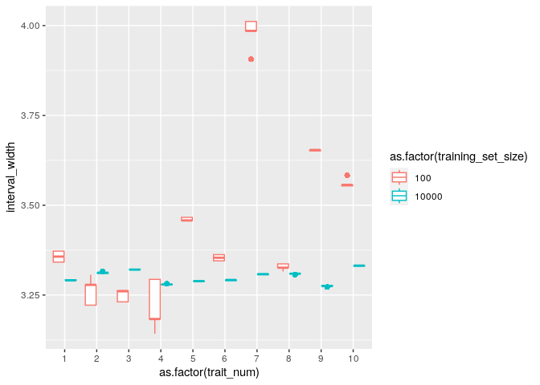

Simulations with a single SNP & different sample sizes
================

<script src="simple2_files/libs/htmlwidgets-1.6.2/htmlwidgets.js"></script>
<script src="simple2_files/libs/plotly-binding-4.10.1/plotly.js"></script>
<script src="simple2_files/libs/setprototypeof-0.1/setprototypeof.js"></script>
<script src="simple2_files/libs/typedarray-0.1/typedarray.min.js"></script>
<script src="simple2_files/libs/jquery-3.5.1/jquery.min.js"></script>
<link href="simple2_files/libs/crosstalk-1.2.0/css/crosstalk.min.css" rel="stylesheet" />
<script src="simple2_files/libs/crosstalk-1.2.0/js/crosstalk.min.js"></script>
<link href="simple2_files/libs/plotly-htmlwidgets-css-2.11.1/plotly-htmlwidgets.css" rel="stylesheet" />
<script src="simple2_files/libs/plotly-main-2.11.1/plotly-latest.min.js"></script>


- <a href="#setup" id="toc-setup"><span
  class="toc-section-number">1</span> Setup</a>
- <a href="#organize-results" id="toc-organize-results"><span
  class="toc-section-number">2</span> Organize results</a>
- <a href="#figures" id="toc-figures"><span
  class="toc-section-number">3</span> Figures</a>
  - <a href="#boxplots-for-interval-width"
    id="toc-boxplots-for-interval-width"><span
    class="toc-section-number">3.1</span> Boxplots for interval width</a>
  - <a href="#relationship-between-hatbeta-and-median-interval-width"
    id="toc-relationship-between-hatbeta-and-median-interval-width"><span
    class="toc-section-number">3.2</span> Relationship between <span
    class="math inline"><em>β̂</em></span> and median interval width</a>
- <a href="#session-info" id="toc-session-info"><span
  class="toc-section-number">4</span> Session Info</a>

## Setup

First, simulate genotype data for 11,000 subjects. Then, for each
subject’s genotype, simulate replicate traits.

``` r
library(magrittr)
```

``` r
set.seed(2023-04-15)
n <- 11000
n_traits <- 10
n_snp <- 1
# simulate genotypes matrix
geno <- matrix(sample(c(0,1,2), n*n_snp, replace=TRUE, prob=c(0.25,0.5,0.25)), nrow=n, ncol=n_snp)
# simulate phenotype
beta <- 10
y <- as.numeric(geno %*% beta) %*% t(rep(1, n_traits)) + matrix(data = rnorm(n * n_traits), nrow = n, ncol = n_traits)
# prepare for splitting into training and testing
n_test <- 1000
# get test subject ids
test_ids <- sample(1:n, n_test, replace = FALSE)
# organize data
dat <- tibble::as_tibble(y) %>%
    dplyr::rename_with(function(x){ num <- stringr::str_extract(x, "[0-9]+")
                                    return(paste0("pheno", num))}
                        ) %>%
    dplyr::bind_cols(geno %>% tibble::as_tibble() %>% dplyr::rename(geno = 1)) %>%
    dplyr::mutate(id = 1:n) %>% # fix this when using more than one SNP
    dplyr::mutate(in_test_set = id %in% test_ids)
```

    Warning: The `x` argument of `as_tibble.matrix()` must have unique column names if
    `.name_repair` is omitted as of tibble 2.0.0.
    ℹ Using compatibility `.name_repair`.

``` r
# split into training and testing
training <- dat %>% dplyr::filter(!in_test_set)
testing <- dat %>% dplyr::filter(in_test_set)
testing2 <- testing %>% dplyr::mutate(fold = as.integer(NA))
# use all training with leave K out
alpha <- 0.1
n_folds <- 5
n_train <- nrow(training)
# partition training data into 5 folds
folds <- split(training$id, sample(rep(1:n_folds, length.out = n_train)))
training2_pre <- training %>% 
    dplyr::mutate(fold = id %>% purrr::map_int(~which(sapply(folds, function(x) . %in% x))))
```

Above, we specified the number of replicates for the simulations. We
created 10 replicate traits for the same 1.1^{4} subjects. Note that
each subject has only 1 SNPs.

``` r
tictoc::tic() # timing
tl <- list()
n_per_fold_values <- c(2000, 20)
for (n_per_fold in n_per_fold_values){
    training2 <- training2_pre %>%
        dplyr::group_by(fold) %>%
        dplyr::slice_sample(n = n_per_fold) %>%
        dplyr::ungroup()
    # store each trait's outputs
    out <- list()
    # loop over traits
    for (trait_num in 1:n_traits){
        tr2_one_trait <- training2 %>%
            dplyr::select(id, fold, geno, tidyselect::ends_with(paste0("pheno", trait_num))) %>%
            dplyr::rename(pheno = tidyselect::ends_with(paste0("pheno", trait_num)))
        te2_one_trait <- testing2 %>%
            dplyr::select(id, fold, geno, tidyselect::ends_with(paste0("pheno", trait_num))) %>%
            dplyr::rename(pheno = tidyselect::ends_with(paste0("pheno", trait_num)))
        
        # regress leaving one fold out
        preds <- list()
        for (fold_num in 1:n_folds) {
            # get training data
            train <- tr2_one_trait %>% dplyr::filter(fold != fold_num)
            # get testing data
            test <- tr2_one_trait %>% dplyr::filter(fold == fold_num)
            # fit model
            fit <- lm(pheno ~ geno, data = train)
            # predict
            foo <- test %>% dplyr::bind_rows(te2_one_trait)
            foo$pred <- predict(fit, newdata = foo)
            foo$fold_left_out <- fold_num
            result <- foo %>%
                dplyr::mutate(beta1_hat = coef(fit)[2],
                              beta0_hat = coef(fit)[1],
                              se_beta1_hat = summary(fit)$coefficients[2, 2],
                              se_beta0_hat = summary(fit)$coefficients[1, 2]
                )
            # save predictions
            preds[[fold_num]] <- result
        }
        # assemble predicted values
        # get absolute residuals
        preds_training <- preds %>%
            dplyr::bind_rows() %>%
            dplyr::filter(!is.na(fold)) %>% # keep only training data
            dplyr::mutate(absolute_residual = abs(pheno - pred)) %>%
            dplyr::select( - fold_left_out)
        preds_test <- preds %>%
            dplyr::bind_rows() %>%
            dplyr::filter(is.na(fold))
        # get indexes
        plus_index <- ceiling((1 - alpha) * (nrow(preds_training) + 1))
        minus_index <- floor(alpha * (nrow(preds_training) + 1))
    
        # go one by one through test set (testing2)
        test_list <- list()
        for (i in 1:nrow(testing2)){
            tt <- testing2[i, ]
            pt2 <- preds_test %>% 
                dplyr::filter(id == tt$id) %>% # our only use of tt
                dplyr::rename_with(function(x)paste0("test_", x)) 
                # pt2 contains the five predicted values for a single test subject
            nrow(pt2) # 5
            preds_all <- preds_training %>%
                dplyr::left_join(pt2, by = c("fold" = "test_fold_left_out")) %>%
                dplyr::mutate(test_fitted_plus_absolute_residual = test_pred + absolute_residual, 
                              test_fitted_minus_absolute_residual = test_pred - absolute_residual) 
            uu <- sort(preds_all$test_fitted_plus_absolute_residual)[plus_index]
            ll <- sort(preds_all$test_fitted_minus_absolute_residual)[minus_index]
            # make a tibble with exactly one row
            test_list[[i]] <- preds_all %>%
                dplyr::select(test_id, test_geno, test_pheno, test_beta1_hat, fold) %>%
                dplyr::mutate(lower = ll, upper = uu) %>%
                dplyr::distinct() %>%
                tidyr::pivot_wider(names_from = fold, 
                                    values_from = test_beta1_hat,
                                    names_prefix = "beta1_hat_fold_"
                                    )
        }
        test_tib <- test_list %>%
            dplyr::bind_rows() %>%
            dplyr::mutate(in_interval = test_pheno >= lower & test_pheno <= upper) %>%
            dplyr::mutate(interval_width = upper - lower) %>%
            dplyr::mutate(training_set_size = n_per_fold * n_folds,
                            trait_num = trait_num)
        out[[trait_num]] <- test_tib
    }
    tl[[as.character(n_per_fold * n_folds)]]  <- out
}
tictoc::toc() # timing
```

    519.553 sec elapsed

## Organize results

``` r
#test_tib_thin <- test_tib %>%
#    dplyr::select(test_id, test_geno)
tt_intermediate <- tl %>%
    dplyr::bind_rows(.id = "id") 
results <- tt_intermediate %>%
    dplyr::group_by(training_set_size, trait_num) %>%
    dplyr::summarise(mean_interval_width = mean(interval_width),
                    sd_interval_width = sd(interval_width),
                    mean_in_interval = mean(in_interval),
                    sd_in_interval = sd(in_interval), 
                    beta1_hat_fold_1 = mean(beta1_hat_fold_1),
                    beta1_hat_fold_2 = mean(beta1_hat_fold_2),
                    beta1_hat_fold_3 = mean(beta1_hat_fold_3),
                    beta1_hat_fold_4 = mean(beta1_hat_fold_4),
                    beta1_hat_fold_5 = mean(beta1_hat_fold_5),
                    median_interval_width = median(interval_width)
                    ) %>%
                    dplyr::ungroup() %>%
                    dplyr::mutate(mean_b1 = purrr::pmap_dbl(.l = list(beta1_hat_fold_1,
                                                                        beta1_hat_fold_2, 
                                                                        beta1_hat_fold_3, 
                                                                        beta1_hat_fold_4,
                                                                         beta1_hat_fold_5), 
                                                           .f = function(x, y, z, w, v) mean(c(x, y, z, w, v))),
                                    sd_b1 = purrr::pmap_dbl(.l = list(beta1_hat_fold_1,
                                                                        beta1_hat_fold_2, 
                                                                        beta1_hat_fold_3, 
                                                                        beta1_hat_fold_4,
                                                                         beta1_hat_fold_5), 
                                                           .f = function(x, y, z, w, v) sd(c(x, y, z, w, v)))
                    ) 
```

    `summarise()` has grouped output by 'training_set_size'. You can override using
    the `.groups` argument.

``` r
results %>%
    knitr::kable() %>%
    print()
```

| training_set_size | trait_num | mean_interval_width | sd_interval_width | mean_in_interval | sd_in_interval | beta1_hat_fold_1 | beta1_hat_fold_2 | beta1_hat_fold_3 | beta1_hat_fold_4 | beta1_hat_fold_5 | median_interval_width |   mean_b1 |     sd_b1 |
|------------------:|----------:|--------------------:|------------------:|-----------------:|---------------:|-----------------:|-----------------:|-----------------:|-----------------:|-----------------:|----------------------:|----------:|----------:|
|               100 |         1 |            3.353573 |         0.0129964 |            0.919 |      0.2729716 |        10.139861 |        10.347822 |        10.216658 |        10.283637 |        10.228992 |              3.357060 | 10.243394 | 0.0777273 |
|               100 |         2 |            3.269282 |         0.0311728 |            0.907 |      0.2905778 |        10.029817 |        10.027591 |        10.082244 |        10.032147 |         9.916443 |              3.278369 | 10.017648 | 0.0609760 |
|               100 |         3 |            3.246337 |         0.0152826 |            0.890 |      0.3130463 |        10.233641 |        10.263063 |        10.217109 |        10.313080 |        10.323161 |              3.260470 | 10.270011 | 0.0470362 |
|               100 |         4 |            3.229049 |         0.0659925 |            0.901 |      0.2988115 |        10.335762 |        10.295860 |        10.263683 |        10.117457 |        10.293189 |              3.183260 | 10.261190 | 0.0843390 |
|               100 |         5 |            3.460026 |         0.0038258 |            0.909 |      0.2877530 |         9.997463 |         9.960094 |         9.997248 |        10.019471 |         9.963694 |              3.457677 |  9.987594 | 0.0251704 |
|               100 |         6 |            3.355759 |         0.0073000 |            0.897 |      0.3041110 |        10.018040 |        10.077735 |        10.142020 |         9.990942 |        10.041804 |              3.353859 | 10.054108 | 0.0585852 |
|               100 |         7 |            3.980449 |         0.0416188 |            0.952 |      0.2138732 |        10.003445 |        10.069239 |        10.034488 |        10.196176 |        10.108486 |              3.985303 | 10.082367 | 0.0747129 |
|               100 |         8 |            3.326653 |         0.0074721 |            0.907 |      0.2905778 |        10.113209 |        10.096988 |        10.119445 |        10.129327 |        10.132087 |              3.326145 | 10.118211 | 0.0140808 |
|               100 |         9 |            3.653136 |         0.0019625 |            0.938 |      0.2412762 |         9.985875 |        10.193415 |        10.082621 |        10.138359 |         9.943896 |              3.653796 | 10.068833 | 0.1037255 |
|               100 |        10 |            3.561284 |         0.0119700 |            0.917 |      0.2760203 |         9.969111 |         9.865656 |         9.826659 |         9.741551 |         9.998203 |              3.556597 |  9.880236 | 0.1050377 |
|             10000 |         1 |            3.290953 |         0.0010846 |            0.918 |      0.2745020 |         9.977913 |         9.984978 |         9.990252 |         9.986172 |         9.980599 |              3.290916 |  9.983983 | 0.0048316 |
|             10000 |         2 |            3.312527 |         0.0020374 |            0.912 |      0.2834367 |         9.982828 |         9.974832 |         9.967156 |         9.985279 |         9.985672 |              3.312160 |  9.979154 | 0.0080021 |
|             10000 |         3 |            3.320756 |         0.0006827 |            0.904 |      0.2947386 |         9.982968 |         9.988185 |         9.993088 |         9.996586 |         9.988597 |              3.320752 |  9.989885 | 0.0051858 |
|             10000 |         4 |            3.279787 |         0.0008393 |            0.909 |      0.2877530 |        10.019184 |        10.022152 |        10.013322 |        10.017043 |        10.011324 |              3.279516 | 10.016605 | 0.0043670 |
|             10000 |         5 |            3.288617 |         0.0002318 |            0.891 |      0.3117952 |         9.987089 |         9.981302 |         9.983809 |         9.983244 |         9.982069 |              3.288720 |  9.983502 | 0.0022316 |
|             10000 |         6 |            3.291975 |         0.0012743 |            0.888 |      0.3155243 |         9.992487 |         9.984260 |         9.978471 |         9.968695 |         9.989893 |              3.291956 |  9.982761 | 0.0095393 |
|             10000 |         7 |            3.307993 |         0.0007978 |            0.905 |      0.2933617 |        10.007027 |         9.996307 |        10.003696 |        10.003574 |        10.010460 |              3.308130 | 10.004213 | 0.0052467 |
|             10000 |         8 |            3.308931 |         0.0010771 |            0.905 |      0.2933617 |        10.000219 |        10.007251 |        10.001309 |        10.010352 |         9.991695 |              3.309422 | 10.002165 | 0.0071944 |
|             10000 |         9 |            3.274744 |         0.0014894 |            0.906 |      0.2919747 |        10.000456 |        10.014163 |        10.013602 |        10.021682 |        10.026449 |              3.274934 | 10.015270 | 0.0098684 |
|             10000 |        10 |            3.331720 |         0.0007399 |            0.897 |      0.3041110 |        10.013960 |        10.004986 |        10.006299 |        10.002682 |        10.014836 |              3.331913 | 10.008553 | 0.0054997 |

## Figures

### Boxplots for interval width

``` r
library(ggplot2)
tt_intermediate %>%
    ggplot(aes(y = interval_width, colour = as.factor(training_set_size), x = as.factor(trait_num)))  +
    geom_boxplot()
```



``` r
ggsave(here::here("figures", "interval_width_boxplot.png"), width = 10, height = 10)
```

### Relationship between $\hat\beta$ and median interval width

``` r
p1 <- results %>%
    ggplot(aes(x = mean_b1, y = median_interval_width, colour = as.factor(training_set_size), replicate_num = trait_num)) +
    geom_point()
plotly::ggplotly(p1, tooltip = c("x", "y", "colour", "replicate_num"))
```

<div class="plotly html-widget html-fill-item-overflow-hidden html-fill-item" id="htmlwidget-66384032ea8dacf9cf22" style="width:672px;height:480px;"></div>
<script type="application/json" data-for="htmlwidget-66384032ea8dacf9cf22">{"x":{"data":[{"x":[10.2433940437877,10.0176483885856,10.2700108864517,10.2611901950608,9.98759419449623,10.0541079766188,10.082366954237,10.1182111732079,10.0688333494942,9.88023574421293],"y":[3.35705988979446,3.27836897169556,3.26046999119021,3.18325981553599,3.45767684767912,3.35385940772134,3.98530264788688,3.32614553727047,3.65379608366288,3.55659670185358],"text":["mean_b1: 10.243394<br />median_interval_width: 3.357060<br />as.factor(training_set_size): 100<br />trait_num:  1","mean_b1: 10.017648<br />median_interval_width: 3.278369<br />as.factor(training_set_size): 100<br />trait_num:  2","mean_b1: 10.270011<br />median_interval_width: 3.260470<br />as.factor(training_set_size): 100<br />trait_num:  3","mean_b1: 10.261190<br />median_interval_width: 3.183260<br />as.factor(training_set_size): 100<br />trait_num:  4","mean_b1:  9.987594<br />median_interval_width: 3.457677<br />as.factor(training_set_size): 100<br />trait_num:  5","mean_b1: 10.054108<br />median_interval_width: 3.353859<br />as.factor(training_set_size): 100<br />trait_num:  6","mean_b1: 10.082367<br />median_interval_width: 3.985303<br />as.factor(training_set_size): 100<br />trait_num:  7","mean_b1: 10.118211<br />median_interval_width: 3.326146<br />as.factor(training_set_size): 100<br />trait_num:  8","mean_b1: 10.068833<br />median_interval_width: 3.653796<br />as.factor(training_set_size): 100<br />trait_num:  9","mean_b1:  9.880236<br />median_interval_width: 3.556597<br />as.factor(training_set_size): 100<br />trait_num: 10"],"type":"scatter","mode":"markers","marker":{"autocolorscale":false,"color":"rgba(248,118,109,1)","opacity":1,"size":5.66929133858268,"symbol":"circle","line":{"width":1.88976377952756,"color":"rgba(248,118,109,1)"}},"hoveron":"points","name":"100","legendgroup":"100","showlegend":true,"xaxis":"x","yaxis":"y","hoverinfo":"text","frame":null},{"x":[9.9839829675685,9.97915349394485,9.98988490997841,10.0166048275612,9.98350233939255,9.98276131389113,10.0042128457108,10.0021653519703,10.015270448938,10.0085525372174],"y":[3.29091596141281,3.31216026092762,3.32075201125707,3.27951584642525,3.2887201820505,3.29195650656544,3.30813011788311,3.30942163819736,3.27493375366424,3.33191250496567],"text":["mean_b1:  9.983983<br />median_interval_width: 3.290916<br />as.factor(training_set_size): 10000<br />trait_num:  1","mean_b1:  9.979153<br />median_interval_width: 3.312160<br />as.factor(training_set_size): 10000<br />trait_num:  2","mean_b1:  9.989885<br />median_interval_width: 3.320752<br />as.factor(training_set_size): 10000<br />trait_num:  3","mean_b1: 10.016605<br />median_interval_width: 3.279516<br />as.factor(training_set_size): 10000<br />trait_num:  4","mean_b1:  9.983502<br />median_interval_width: 3.288720<br />as.factor(training_set_size): 10000<br />trait_num:  5","mean_b1:  9.982761<br />median_interval_width: 3.291957<br />as.factor(training_set_size): 10000<br />trait_num:  6","mean_b1: 10.004213<br />median_interval_width: 3.308130<br />as.factor(training_set_size): 10000<br />trait_num:  7","mean_b1: 10.002165<br />median_interval_width: 3.309422<br />as.factor(training_set_size): 10000<br />trait_num:  8","mean_b1: 10.015270<br />median_interval_width: 3.274934<br />as.factor(training_set_size): 10000<br />trait_num:  9","mean_b1: 10.008553<br />median_interval_width: 3.331913<br />as.factor(training_set_size): 10000<br />trait_num: 10"],"type":"scatter","mode":"markers","marker":{"autocolorscale":false,"color":"rgba(0,191,196,1)","opacity":1,"size":5.66929133858268,"symbol":"circle","line":{"width":1.88976377952756,"color":"rgba(0,191,196,1)"}},"hoveron":"points","name":"10000","legendgroup":"10000","showlegend":true,"xaxis":"x","yaxis":"y","hoverinfo":"text","frame":null}],"layout":{"margin":{"t":26.2283105022831,"r":7.30593607305936,"b":40.1826484018265,"l":43.1050228310502},"plot_bgcolor":"rgba(235,235,235,1)","paper_bgcolor":"rgba(255,255,255,1)","font":{"color":"rgba(0,0,0,1)","family":"","size":14.6118721461187},"xaxis":{"domain":[0,1],"automargin":true,"type":"linear","autorange":false,"range":[9.86074698710099,10.2894996435636],"tickmode":"array","ticktext":["9.9","10.0","10.1","10.2"],"tickvals":[9.9,10,10.1,10.2],"categoryorder":"array","categoryarray":["9.9","10.0","10.1","10.2"],"nticks":null,"ticks":"outside","tickcolor":"rgba(51,51,51,1)","ticklen":3.65296803652968,"tickwidth":0.66417600664176,"showticklabels":true,"tickfont":{"color":"rgba(77,77,77,1)","family":"","size":11.689497716895},"tickangle":-0,"showline":false,"linecolor":null,"linewidth":0,"showgrid":true,"gridcolor":"rgba(255,255,255,1)","gridwidth":0.66417600664176,"zeroline":false,"anchor":"y","title":{"text":"mean_b1","font":{"color":"rgba(0,0,0,1)","family":"","size":14.6118721461187}},"hoverformat":".2f"},"yaxis":{"domain":[0,1],"automargin":true,"type":"linear","autorange":false,"range":[3.14315767391844,4.02540478950443],"tickmode":"array","ticktext":["3.2","3.4","3.6","3.8","4.0"],"tickvals":[3.2,3.4,3.6,3.8,4],"categoryorder":"array","categoryarray":["3.2","3.4","3.6","3.8","4.0"],"nticks":null,"ticks":"outside","tickcolor":"rgba(51,51,51,1)","ticklen":3.65296803652968,"tickwidth":0.66417600664176,"showticklabels":true,"tickfont":{"color":"rgba(77,77,77,1)","family":"","size":11.689497716895},"tickangle":-0,"showline":false,"linecolor":null,"linewidth":0,"showgrid":true,"gridcolor":"rgba(255,255,255,1)","gridwidth":0.66417600664176,"zeroline":false,"anchor":"x","title":{"text":"median_interval_width","font":{"color":"rgba(0,0,0,1)","family":"","size":14.6118721461187}},"hoverformat":".2f"},"shapes":[{"type":"rect","fillcolor":null,"line":{"color":null,"width":0,"linetype":[]},"yref":"paper","xref":"paper","x0":0,"x1":1,"y0":0,"y1":1}],"showlegend":true,"legend":{"bgcolor":"rgba(255,255,255,1)","bordercolor":"transparent","borderwidth":1.88976377952756,"font":{"color":"rgba(0,0,0,1)","family":"","size":11.689497716895},"title":{"text":"as.factor(training_set_size)","font":{"color":"rgba(0,0,0,1)","family":"","size":14.6118721461187}}},"hovermode":"closest","barmode":"relative"},"config":{"doubleClick":"reset","modeBarButtonsToAdd":["hoverclosest","hovercompare"],"showSendToCloud":false},"source":"A","attrs":{"edbd200db221":{"x":{},"y":{},"colour":{},"replicate_num":{},"type":"scatter"}},"cur_data":"edbd200db221","visdat":{"edbd200db221":["function (y) ","x"]},"highlight":{"on":"plotly_click","persistent":false,"dynamic":false,"selectize":false,"opacityDim":0.2,"selected":{"opacity":1},"debounce":0},"shinyEvents":["plotly_hover","plotly_click","plotly_selected","plotly_relayout","plotly_brushed","plotly_brushing","plotly_clickannotation","plotly_doubleclick","plotly_deselect","plotly_afterplot","plotly_sunburstclick"],"base_url":"https://plot.ly"},"evals":[],"jsHooks":[]}</script>

## Session Info

``` r
sessioninfo::session_info()
```

    ─ Session info ───────────────────────────────────────────────────────────────
     setting  value
     version  R version 4.2.3 (2023-03-15)
     os       Ubuntu 18.04.6 LTS
     system   x86_64, linux-gnu
     ui       X11
     language en_US:
     collate  en_US.UTF-8
     ctype    en_US.UTF-8
     tz       America/Detroit
     date     2023-04-23
     pandoc   1.19.2.4 @ /usr/bin/ (via rmarkdown)

    ─ Packages ───────────────────────────────────────────────────────────────────
     package     * version date (UTC) lib source
     cli           3.6.1   2023-03-23 [1] CRAN (R 4.2.3)
     colorspace    2.1-0   2023-01-23 [1] CRAN (R 4.2.2)
     crosstalk     1.2.0   2021-11-04 [1] CRAN (R 4.1.2)
     data.table    1.14.8  2023-02-17 [1] CRAN (R 4.2.2)
     digest        0.6.31  2022-12-11 [1] CRAN (R 4.2.2)
     dplyr         1.1.1   2023-03-22 [1] CRAN (R 4.2.3)
     ellipsis      0.3.2   2021-04-29 [2] CRAN (R 4.2.1)
     evaluate      0.20    2023-01-17 [1] CRAN (R 4.2.2)
     fansi         1.0.4   2023-01-22 [1] CRAN (R 4.2.2)
     farver        2.1.1   2022-07-06 [1] CRAN (R 4.2.3)
     fastmap       1.1.1   2023-02-24 [1] CRAN (R 4.2.3)
     generics      0.1.3   2022-07-05 [1] CRAN (R 4.2.3)
     ggplot2     * 3.4.2   2023-04-03 [1] CRAN (R 4.2.3)
     glue          1.6.2   2022-02-24 [1] CRAN (R 4.2.0)
     gtable        0.3.3   2023-03-21 [1] CRAN (R 4.2.3)
     here          1.0.1   2020-12-13 [2] CRAN (R 4.1.1)
     htmltools     0.5.5   2023-03-23 [1] CRAN (R 4.2.3)
     htmlwidgets   1.6.2   2023-03-17 [1] CRAN (R 4.2.2)
     httr          1.4.5   2023-02-24 [1] CRAN (R 4.2.3)
     jsonlite      1.8.4   2022-12-06 [1] CRAN (R 4.2.3)
     knitr         1.42    2023-01-25 [1] CRAN (R 4.2.3)
     labeling      0.4.2   2020-10-20 [2] CRAN (R 4.0.3)
     lazyeval      0.2.2   2019-03-15 [2] CRAN (R 4.0.3)
     lifecycle     1.0.3   2022-10-07 [1] CRAN (R 4.2.2)
     magrittr    * 2.0.3   2022-03-30 [1] CRAN (R 4.2.0)
     munsell       0.5.0   2018-06-12 [2] CRAN (R 4.0.3)
     pillar        1.9.0   2023-03-22 [1] CRAN (R 4.2.3)
     pkgconfig     2.0.3   2019-09-22 [2] CRAN (R 4.0.3)
     plotly        4.10.1  2022-11-07 [1] CRAN (R 4.2.2)
     purrr         1.0.1   2023-01-10 [1] CRAN (R 4.2.2)
     R6            2.5.1   2021-08-19 [2] CRAN (R 4.1.1)
     ragg          1.2.5   2023-01-12 [1] CRAN (R 4.2.2)
     rlang         1.1.0   2023-03-14 [1] CRAN (R 4.2.2)
     rmarkdown     2.21    2023-03-26 [1] CRAN (R 4.2.3)
     rprojroot     2.0.3   2022-04-02 [2] CRAN (R 4.2.0)
     scales        1.2.1   2022-08-20 [1] CRAN (R 4.2.3)
     sessioninfo   1.2.2   2021-12-06 [1] CRAN (R 4.1.2)
     stringi       1.7.12  2023-01-11 [1] CRAN (R 4.2.2)
     stringr       1.5.0   2022-12-02 [1] CRAN (R 4.2.3)
     systemfonts   1.0.4   2022-02-11 [2] CRAN (R 4.2.0)
     textshaping   0.3.6   2021-10-13 [1] CRAN (R 4.2.2)
     tibble        3.2.1   2023-03-20 [1] CRAN (R 4.2.3)
     tictoc        1.1     2022-09-03 [1] CRAN (R 4.2.1)
     tidyr         1.3.0   2023-01-24 [1] CRAN (R 4.2.3)
     tidyselect    1.2.0   2022-10-10 [1] CRAN (R 4.2.2)
     utf8          1.2.3   2023-01-31 [1] CRAN (R 4.2.3)
     vctrs         0.6.1   2023-03-22 [1] CRAN (R 4.2.3)
     viridisLite   0.4.1   2022-08-22 [1] CRAN (R 4.2.3)
     withr         2.5.0   2022-03-03 [1] CRAN (R 4.2.0)
     xfun          0.38    2023-03-24 [1] CRAN (R 4.2.3)
     yaml          2.3.7   2023-01-23 [1] CRAN (R 4.2.3)

     [1] /net/mulan/home/fredboe/R/x86_64-pc-linux-gnu-library/4.0
     [2] /net/mario/cluster/lib/R/site-library-bionic-40
     [3] /usr/local/lib/R/site-library
     [4] /usr/lib/R/site-library
     [5] /usr/lib/R/library

    ──────────────────────────────────────────────────────────────────────────────

``` r
# git commit info
gr <- git2r::repository(here::here()) %>%
    git2r::commits()
gr[[1]] 
```

    [35cdc16] 2023-04-23: fix: rendered to html
